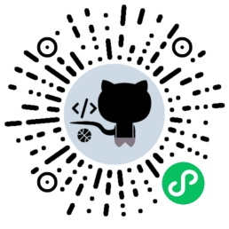

# programer-card

> talk is cheap , show me the code.

[[changelog](./CHANGELOG.md)]
## 先上个二维码

不科学上网的朋友们，看不到可以直接在微信里面搜索 `程序员名片` 关键字

## 代码
私有的东西太多，只能选择性开源

三部分：
  - serverless graphql/rest client , 和 Github 通信用
  - 小程序云开发(cloudbase),其实就是 serverless 那一套的小程序定制版
  - uni-app 写的小程序

## 感谢测试人员
💖 Thanks to
  - [LikeSco](https://github.com/LikeSco)
  - [tsukasa521](https://github.com/tsukasa521)
## 为什么写？

2021年春节假期过得太无聊了

## 2.0.0 (2021-12-31)

发布 `2.0.0` 版本，重构了大量的代码，给 `2021` 画上一个句号。